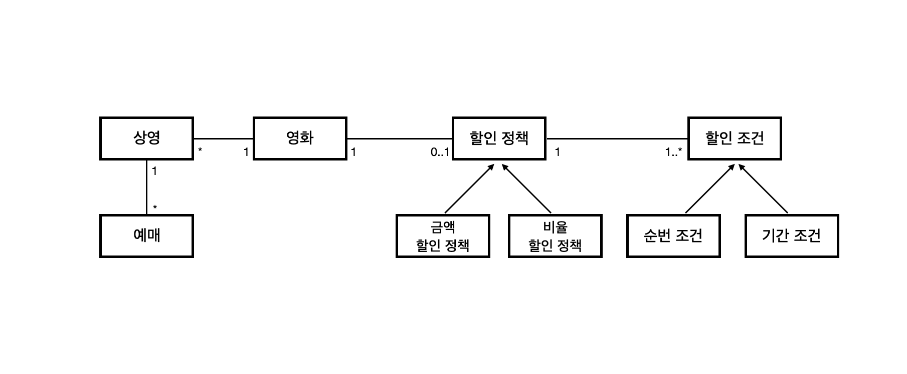
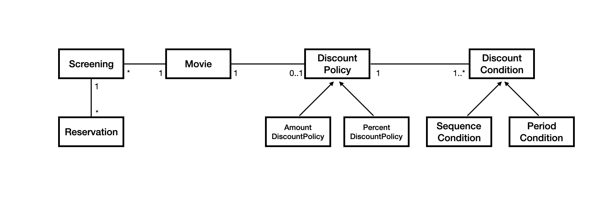
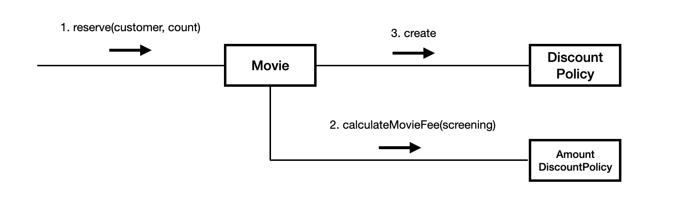
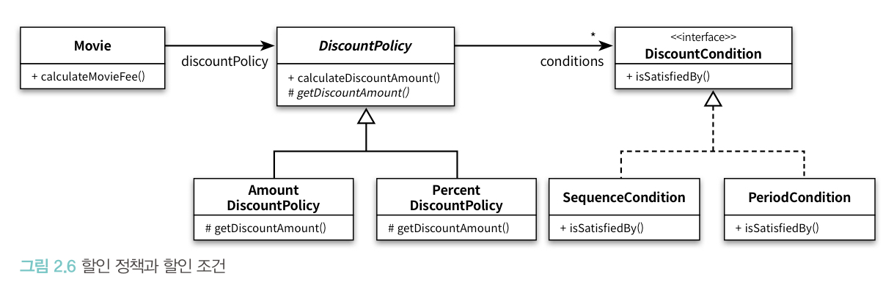

# 객체지향 프로그래밍

## 2-1 영화 예매 시스템

용어 정리
- 영화: 영화에 대한 기본 정보(제목, 상영시간, 가격 등)
- 상영: 실제로 관객들이 영화를 관람하는 사건
- 할인 조건(discount condition): 가격의 할인 여부 결정
  - 순서 조건(sequence condition): 상영 순번을 이용해 할인 여부 결정
  - 기간 조건(period condition): 영화 상영 시작 시간을 이용해 할인 여부를 결정
    - 요일, 시작 시간, 종료 시간으로 구성
    - 영화 시작 시간이 해당 기간 안에 포함될 경우 요금 할인
- 할인 정책(discount policy)
  - 금액 할인 정책(amount discount policy): 예매 요금에서 일정 금액을 할인해주는 방식
  - 비율 할인 정책(percent discount policy): 정가에서 일정 요금을 할인해 주는 방식

조건
- 영화별로 하나의 할인 정책만 할당할 수 있음
- 할인 조건은 여러 개를 적용할 수 있음

## 2-2 객체지향 프로그래밍을 위해

### 협력, 객체, 클래스

> 객체지향은 객체를 지향하는 것이다

1. **어떤 클래스가 필요한지를 고민하기 전에 어떤 객체들이 필요한지 고민해야 함**
   - 클래스는 공통적인 상태와 행동을 공유하는 객체들을 추상화한 것
   - 클래스의 윤곽을 잡기 위해서는 어떤 객체들이 어떤 상태와 행동을 가지는지를 먼저 결정해야 함
2. 객체를 독립적인 존재가 아니라 기능을 구현하기 위해 협력하는 공동체의 일원으로 봐야 함
   - 객체를 협력하는 공동체의 일원으로 보는 것은 설계를 유연하고 확장 가능하게 만듦

### 도메인의 구조를 따르는 프로그램 구조

**도메인이란?**
> 사용자가 현실 세계에 있는 문제를 해결하기 위해 프로그램을 사용하는 분야

- 객체지향은 요구사항 분석 단계부터 마지막까지 객체라는 동일한 추상화 기법을 사용할 수 있음
- 요구사항, 객체, 도메인을 자연스럽게 연결시킬 수 있음

이를 클래스 구조로 바꿀 수 있음

### 클래스 구현하기

**자율적인 객체**

객체란?
- 상태(state)와 행동(behavior)를 가지는 존재
- 스스로 판단하고 행동하는 자율적인 존재

> 객체 내부에 대한 접근을 통제하는 이유는 객체를 자율적인 존재로 만들기 위해서다. 
> 객체지향의 핵심은 스스로 상태를 관리하고, 판단하고, 행동하는 자율적인 객체들의 공동체를 구성하는 것이다.  
> 객체가 자율적인 존재로 우뚝 서기 위해서는 외부의 간섭을 최소화해야 한다.

**프로그래머의 자유**

클래스 작성자
- 새로운 데이터 타입을 프로그램에 추가
- 클라이언트 프로그래머에게 필요한 부분만 공개하고 나머지 숨겨야 함
- 구현 은닉(implementation hiding)

클라이언트 프로그래머
- 클래스 작성자가 추가한 데이터 타입 사용
- 필요한 클래스들을 엮어서 애플리케이션을 빠르고 안정적으로 구축하는 것이 목표

> 이런 식으로 객체의 외부와 내부를 분리하면 클라이언트 프로그래머가 알아야 할 지식의 양이 줄어들고 클래스 작성자가 자유롭게 구현을 변경할 수 있는 폭이 커짐

### 협력하는 객체들의 공동체

### 협력에 관한 짧은 이야기

> 객체는 다른 객체의 인터페이스에 공개된 행동을 수행하도록 요청(request)할 수 있다. 
> 요청을 받은 객체는 자율적인 방법에 따라 요청을 처리한 후 응답(response)한다.

- 요청 -> 메시지를 전송
- 응답 -> 메시지를 수신
- 수신된 메시지를 처리하기 위한 방법 -> 메서드

## 2-3 할인 요금 구하기

### 할인 요금 계산을 위한 협력 시작하기

할인 요금 정책을 결정하는 것은 Movie가 아니라 DiscountPolicy
- 상속, 다형성, 추상화가 사용됨

### 할인 정책과 할인 조건

- DiscountPolicy는 할인 여부와 관련된 전체적인 흐름은 정의하지만 실제로 계산은 추상 메서드인 getDiscountAmount에 위임
- Template Method 패턴: 부모 클래스에 기본적인 알고리즘 흐름을 구현하고 중간에 필요한 처리를 자식 클래스에 위임

## 2-4 상속과 다형성

### 컴파일 시간 의존성과 실행 시간 의존성

Movie는 DiscountPolicy에 의존하지만, 실제로 할인 정책을 적용하기 위해서는 구현체인 AmountDiscountPolicy나 PercentDiscountPolicy가 필요함

하지만 실제로 런타임 상황에서 보면 Movie는 AmountDiscountPolicy, PercentDiscountPolicy와 협력하고 있음

**코드의 의존성과 실행 시점의 의존성이 다름**

- 코드의 의존성과 실행 시점의 의존성이 다를수록 코드를 이해하기 어려워짐
  - 디버깅 힘듬
- 코드의 의존성과 실행 시점의 의존성이 다를수록 유연하고 확장 가능해짐
  - 재사용성 높아짐
- 어느 한 쪽이 정답이 아닌 트레이드오프가 존재함

### 차이에 의한 프로그래밍

DiscountPolicy에 정의된 모든 속성과 메서드를 물려받는 상속을 이용

### 상속과 인터페이스

- 상속: 부모 클래스가 제공하는 모든 인터페이스를 자식 클래스가 물려받을 수 있음
  - 메서드, 인스턴스 변수 재사용 목적 x
- 인터페이스: 객체가 이해할 수 있는 메시지 목록을 정의하는 것

### 다형성

다형성
- 동일한 메시지를 수신하는 객체에 따라 다른 응답(다른 메서드)을 수행하는 것
- 컴파일 시간 의존성과 실행 시간 의존성이 다를 수 있다는 사실을 기반으로 함
- **동적 바인딩, 지연 바인딩** <-> 정적 바인딩, 초기 바인딩

### 인터페이스아 다형성

추상 클래스와 달리 구현을 공유할 필요가 없음