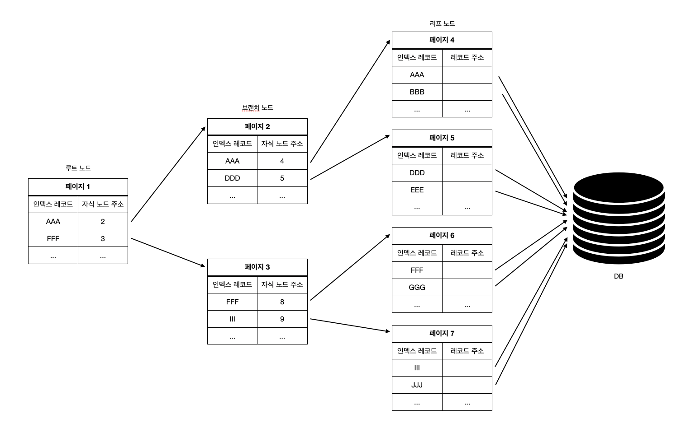

## 5.2 인덱스란?

인덱스란 칼럼의 값과 해당 레코드가 저장된 주소를 key-value로 만들어두는 것

- 데이터의 저장(insert, update, delete)의 성능을 희생하고 읽기 속도를 높이는 기능
- where 조건절에 사용되는 칼럼이라고 전부 인덱스로 생성하면 역효과가 생김

### Primary Key 인덱스 (Cluster 인덱스)

레코드를 대표하는 칼럼의 값으로 만들어진 인덱스

pk이기 때문에 null과 중복 허용 x

### Secondary Key 인덱스

pk를 제외한 나머지 모든 인덱스

### 데이터 저장 방식

B-Tree 또는 Hash 사용

## 5.3 B-Tree 인덱스 (Balanced Tree Index)

가장 범용적으로 사용되는 인덱스

### 5.3.1 구조 및 특성

루트 노드 - 브랜치 노드 - 리프 노드 구조

- 루트와 브랜치 노드에는 다음 자식 노드의 주소가 담겨있음
- 리프 노드에는 최종적인 데이터 주소가 담겨있음
- 이분탐색을 생각하면 쉬움

