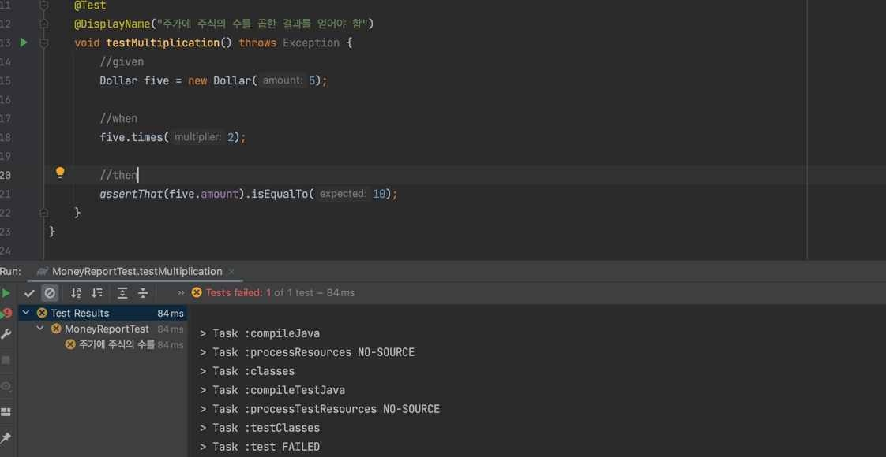
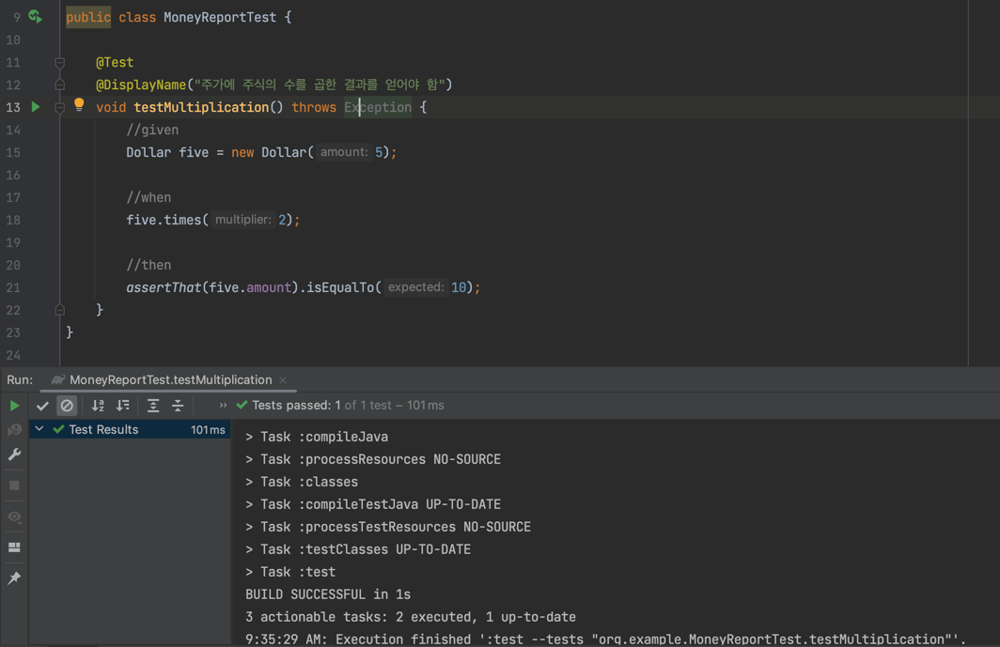

# 1장. 다중 통화를 지원하는 Money 객체

TDD 주기
1. 빠르게 테스트 추가
2. 모든 테스트를 실행하고 새로 추가한 것이 실패하는지 확인
3. 코드 변경
4. 테스트 실행하고 전부 성공하는지 확인
5. 리팩터링을 통해 중복 제거

기본 보고서 형태

| 종목  | 주    | 가격  | 합계    |
|-----|------|-----|-------|
| IBM | 1000 | 25  | 25000 |
| GE  | 400  | 100 | 40000 |
| .   | .    | 합계  | 65000 |

다중 통화 지원 보고서 형태

| 종목       | 주    | 가격     | 합계       |
|----------|------|--------|----------|
| IBM      | 1000 | 25USD  | 25000USD |
| Novartis | 400  | 100CHF | 60000CHF |
| .        | .    | 합계     | 65000USD |

환율

| 기준  | 변환  | 환율  |
|-----|-----|-----|
| CHF | USD | 1.5 |


새로운 보고서를 위한 코드를 확신하기 위한 내용

- 통화가 다른 두 금액을 더해서 주어진 환율에 맞게 변한 금액을 결과로 얻을 수 있어야 함
- 어떤 금액(주가)을 어떤 수(주식의 수)에 곱한 금액을 결과로 얻을 수 있어야 함

## 1. 빠르게 테스트 추가

- 첫 번째는 복잡함
- 두 번째 항목부터 먼저 시작

```java
@Test
@DisplayName("달러에 수를 곱한 결과를 얻어야 함")
void testMultiplication() throws Exception {
    //given
    Dollar five = new Dollor(5);
    
    //when
    five.times(2);

    //then
    assertThat(five.amount).isEqualTo(10);
}
```

**할 일 목록**

```text
$5 + 10CHF = $10 (환율 2:1 경우)
$5 * 2 = $10 ⬅
amount를 private로 만들기
Dollar의 부작용?
Money 반올림?
```

현재 문제점

- Dollar 클래스 없음
- 생성자 없음
- times(int) 메서드 없음
- amount 필드 없음

### 2. 모든 테스트를 실행하고 새로 추가한 것이 실패하는지 확인

```java
public class Dollar {
    
    public int amount;

    public Dollar(int amount) {}

    public void times(int multiplier) {}
}
```

**테스트**



### 3. 코드 변경

amount를 10으로 선언해, 일단은 테스트가 통과하도록 변경

```java
public class Dollar {
    public int amount = 10;
    
    //...
}
```

### 4. 테스트 실행하고 전부 성공하는지 확인



### 5. 리팩터링을 통해 중복 제거

의존성
- 소프트웨어 개발의 모든 부분에서 핵심적인 문제

중복
- 문제의 징후
- 중복을 제거하면 의존성도 제거되는 경우가 많음
- TDD 두 번째 규칙으로 다음 테스트로 넘어가기 전에 중복을 제거

```java
public class Dollar {
    public int amount = 5 * 2;

    //...
}
```

```java
public class Dollar {
    public int amount;

    public void times(int multiplier) {
        amount = 2 * 5;
    }
}
```

> TDD의 핵심은 이런 작은 단계를 밟아야 한다는 것이 아니라, 이런 작은 단계를 밟을 능력을 갖추어야 한다는 것이다.(49p)

```java
public class Dollar {
    public int amount;

    public Dollar(int amount) {
        this.amount = amount;
    }

    public void times(int multiplier) {
        amount = amount * 2;
    }
}
```

```java
public class Dollar {
    //...

    public void times(int multiplier) {
        amount = amount * multiplier;
    }
}
```

**할 일 목록**

```text
$5 + 10CHF = $10 (환율 2:1 경우)
✅ $5 * 2 = $10
amount를 private로 만들기
Dollar의 부작용?
Money 반올림?
```

진행 순서
- 작업해야 할 테스트 목록 만듬
- 오퍼레이션이 외부에서 어떻게 보이길 원하는지 말해주는 이야기를 코드로 표현
- JUnit에 대한 상세 사항 무시
- 스텁 구현을 통해 테스트 컴파일
- 상수 처리로 테스트 통과
- 상수를 변수로 변경하여 점진적 일반화
- 할 일 목록 수정