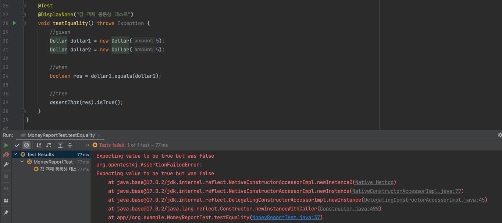
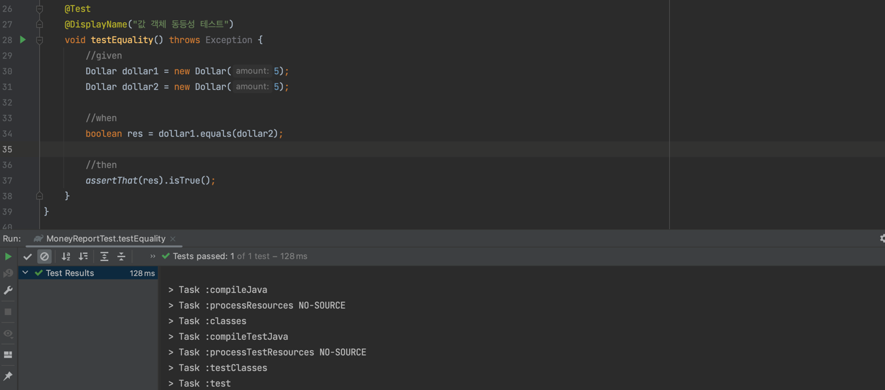

# 3장. 모두를 위한 평등

**값 객체 패턴(Value Object Pattern)**
- 객체를 값처럼 쓰는 패턴
- 인스턴스 변수가 생성자를 통해서 일단 설정된 후에는 결코 변하지 않음

**할 일 목록**

```text
$5 + 10CHF = $10 (환율 2:1 경우)
✅ $5 * 2 = $10
amount를 private로 만들기
✅ Dollar의 부작용?
Money 반올림?
equals() ⬅
hashCode()
```

### 1. 테스트 작성

```java
@Test
@DisplayName("값 객체 동등성 테스트")
void testEquality() throws Exception {
    assertThat(new Dollar(5).equals(new Dollar(5))).isTrue();
}
```

### 2. 테스트 실패



### 3. 코드 변경

```java
public class Dollar {
    //...

    @Override
    public boolean equals(Object obj) {
        return true;
    }
}
```

### 4. 테스트 성공



### 5. 코드 리팩터링

**테스트를 성공하는 세 번째 방법**

삼각측략 전략
- 라디오 신호를 두 수신국이 감지하고 있을 때, 수신국 사이의 거리가 알려져 있고 각 수신국이 신호의 방향을 알고 있다면,
  이 정보들만으로 충분히 신호의 거리와 방위를 알 수 있다.
- 두 개 이상의 테스트 코드 필요

```java
@Test
@DisplayName("값 객체 동등성 테스트")
void testEquality() throws Exception {
    assertThat(new Dollar(5).equals(new Dollar(5))).isTrue();
    assertThat(new Dollar(5).equals(new Dollar(6))).isFalse();
}
```

```java
@Override
public boolean equals(Object obj) {
    Dollar dollar = (Dollar) obj;
    return amount == dollar.amount;
}
```

**언제 사용?**
- 어떻게 리팩터링 해야 하는지 전혀 감이 안 올 때
- 문제를 다른 방향에서 생각해볼 기회를 제공

**할 일 목록**

```text
$5 + 10CHF = $10 (환율 2:1 경우)
✅ $5 * 2 = $10
amount를 private로 만들기
✅ Dollar의 부작용?
Money 반올림?
✅ equals()
hashCode()
Equal null
Equal object
```

